# File upload vulnerabilities

## PRACTITIONER

### Lab: Web shell upload via path traversal

này upload web shell PHP lên đường dẫn vuln

đăng nhập vào

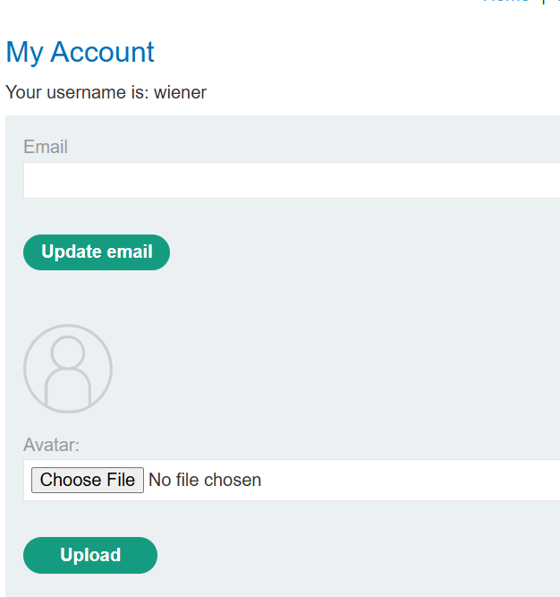

đã gọi là web shell upload thì phải có chỗ upload chứ nhỉ 

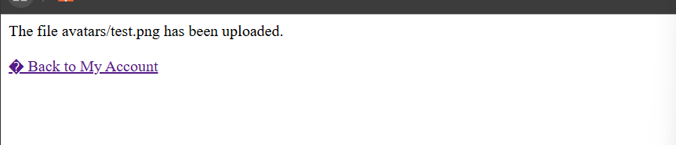

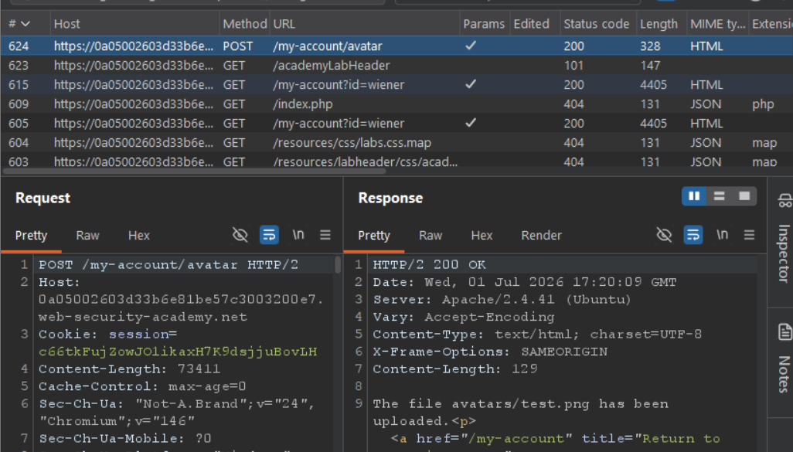

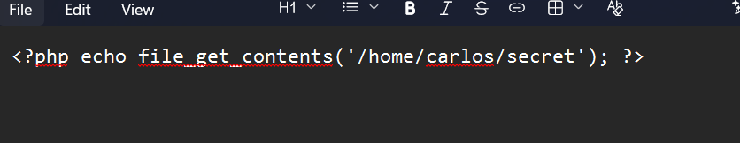

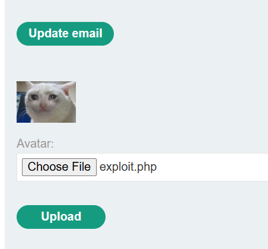

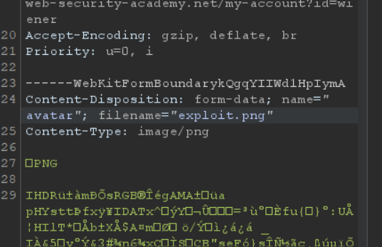

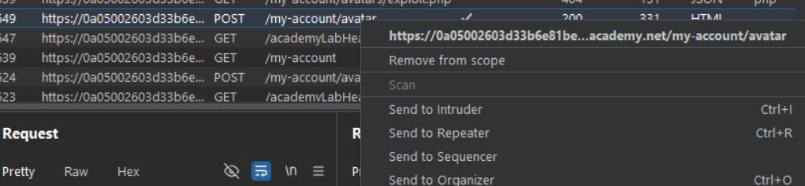

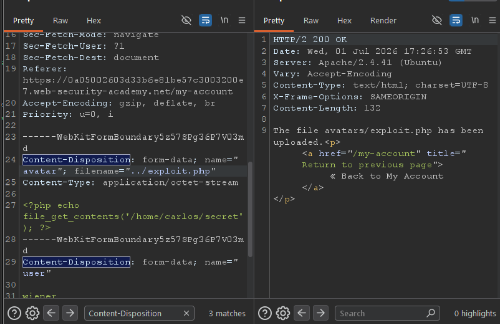

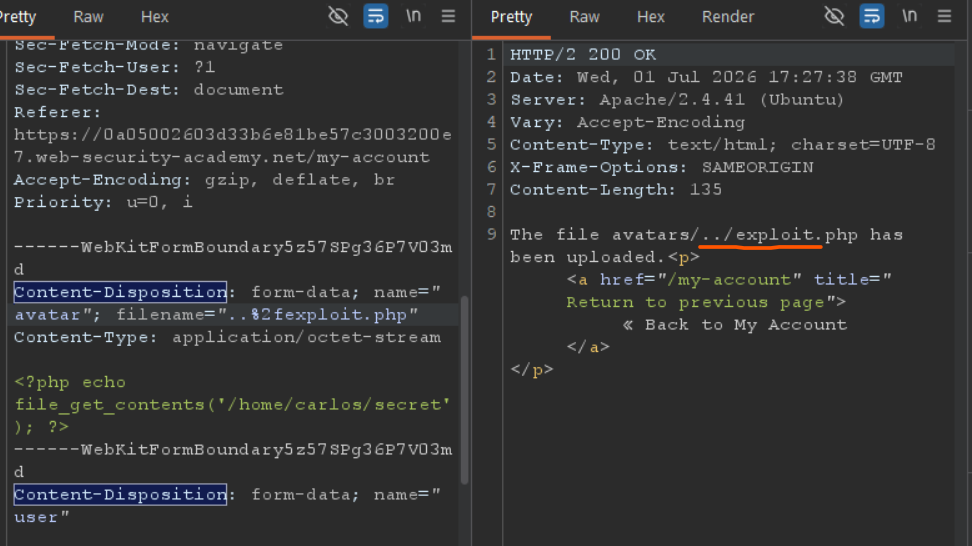

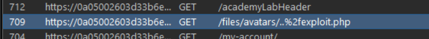

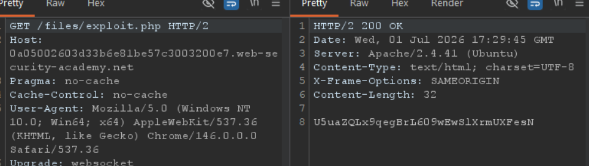

###