# [Infinite money logic flaw]

**Category:** SQL Injection

**Difficulty:**  Practitioner

**Link:** [PortSwigger Lab](https://portswigger.net/web-security/logic-flaws/examples/lab-logic-flaws-infinite-money)

**Status:** ✅ Solved

**Date:** 2026-06-22

---

##  Mô tả

Lab này có một lỗi logic trong quy trình mua hàng. Việc áp dụng coupon giảm giá lên gift card cho phép tạo ra một vòng lặp sinh lãi vô hạn, từ đó có thể tích lũy đủ store credit để mua món hàng đắt tiền mà không cần trả đúng giá.

## 🎯 Mục tiêu

Để giải được lab này ta cần phải mua thành công item "Lightweight l33t leather jacket"

## 🔍 Root Cause

Lỗi nằm ở việc coupon discount được áp dụng lên giá mua gift card, nhưng khi redeem gift card, hệ thống lại cộng vào store credit theo giá trị mặt (face value) của gift card, không phải giá đã trả.

> Cụ thể: Gift card có giá trị $10. Khi mua, coupon SIGNUP30 giảm 30% → chỉ trả $7. Nhưng khi redeem, hệ thống vẫn cộng đủ $10 vào store credit — tạo ra khoản lãi $3 mỗi vòng lặp.

Đây là lỗi thuộc nhóm "Flawed enforcement of business rules" nhưng nghiêm trọng hơn vì có thể tự động hóa và lặp vô hạn, biến một khoản lãi nhỏ ($3) thành một con số lớn (412 lần × $3 = $1236+) chỉ bằng cách spam request.

## 🛠️ Exploitation Steps

### Bước 1: Recon / Phát hiện

login bằng credential: wiener/peter. 
quay về /home và signup email để nhận coupon code

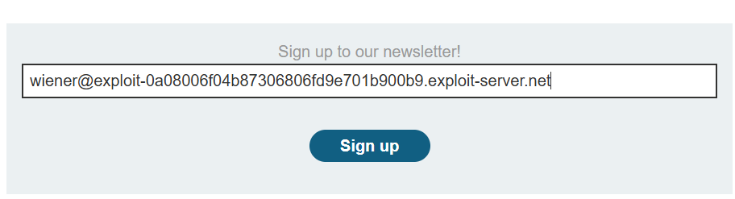

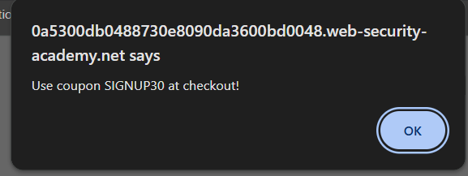

điểm thú vị là bạn có thể mua món hàng $10 gift cards và nhận nó ở My account.


xong tới phần thanh toán -> ta đưa mã SIGNUP30 vào để giảm 30%

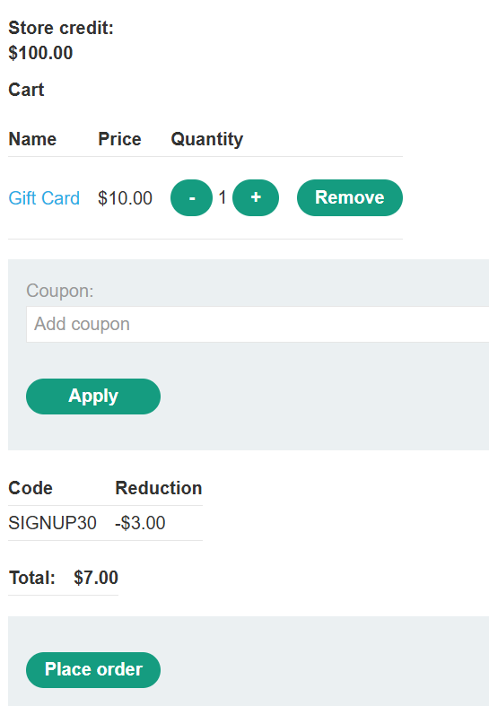

sẽ được cái code. xong ta nhận cái code đó ở My account

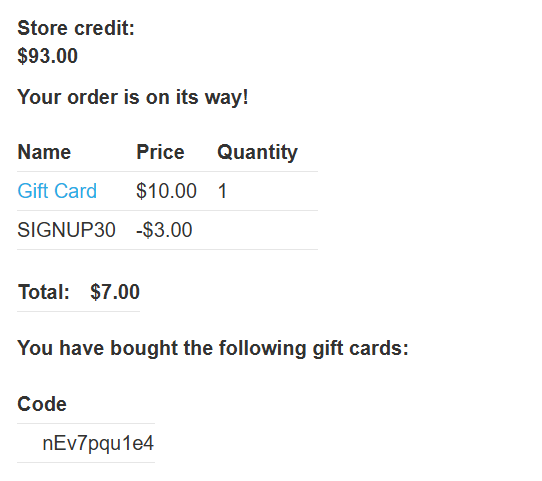

và lãi được $3

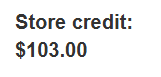

=> nếu ta có thể lặp đi lặp lại bước này thì ta sẽ dư tiền luôn.

### Bước 2: Khai thác

Quan sát lịch sử proxy và lưu ý rằng bạn đã sử dụng thẻ quà tặng bằng cách cung cấp mã trong tham số *gift-card* của *POST /gift-card*.

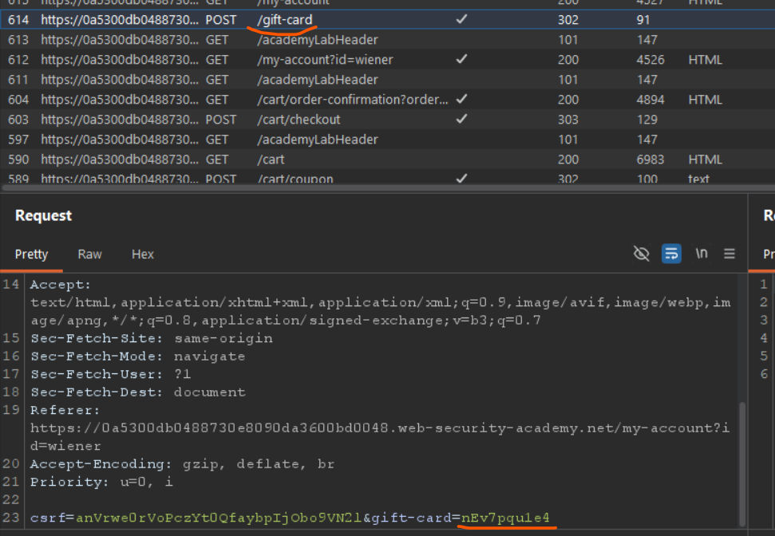

Mở Settings ở góc phải BurpSuite. Chọn *Sessions*

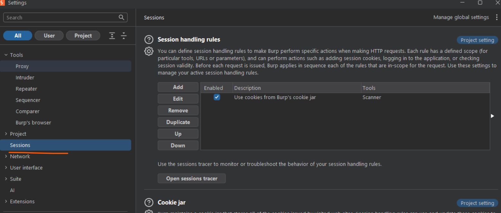

trong *Session handling rules* ấn Add. 
trong tab *Scope* chọn *Include all URLs* 

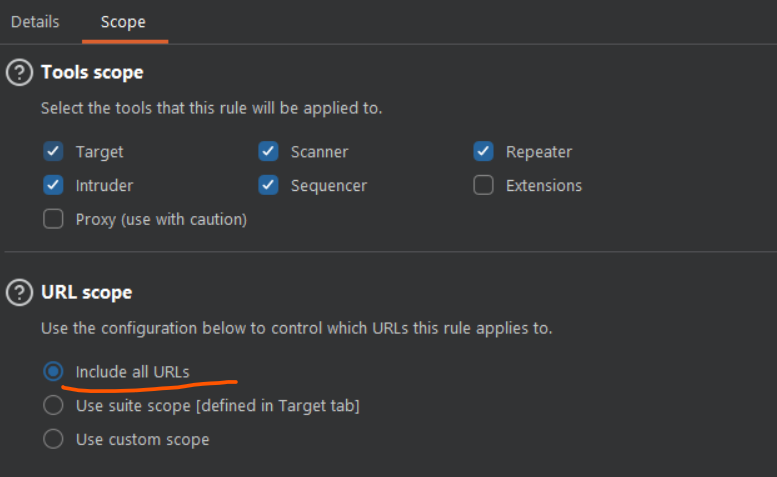

Quay lại tab *Details*, Trong phần *Rule actions*, hãy nhấp vào Thêm (Add) > Chạy macro (Run a macro)

 Trong phần Chọn macro (Select macro), hãy nhấp vào Thêm (Add) một lần nữa để mở Trình ghi macro (Macro Recorder).

Ở đây chọn các request theo thứ tự sau: 
```
POST /cart
POST /cart/coupon
POST /cart/checkout
GET /cart/order-confirmation?order-confirmed=true
POST /gift-card
```

Sau đó click OK. Hộp *Macro Editor* mở ra

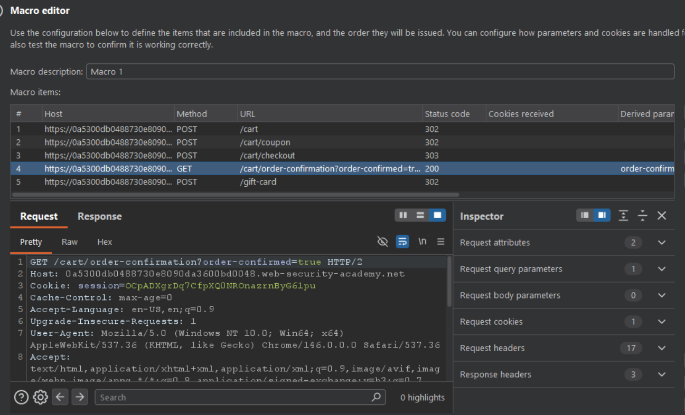

Trong danh sách các yêu cầu, hãy chọn `GET /cart/order-confirmation?order-confirmed=true`. Nhấp vào **Configure item**. Trong hộp thoại hiện ra, nhấp vào **Add** để tạo một tham số tùy chỉnh. Đặt tên tham số là `gift-card` và bôi đen mã thẻ quà tặng ở phần cuối của phản hồi. Nhấp vào **OK** hai lần để quay lại trình chỉnh sửa Macro (Macro Editor).

Chọn yêu cầu POST /gift-card và nhấp vào Configure item một lần nữa. Trong phần Parameter handling, hãy sử dụng các menu thả xuống để chỉ định rằng tham số gift-card sẽ được lấy từ phản hồi trước đó (phản hồi số 4). Nhấp vào OK.

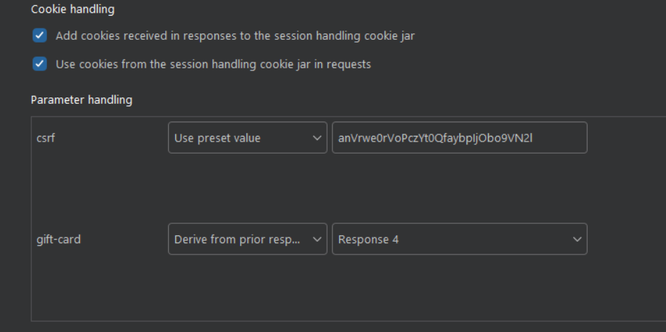

Trong Macro Editor, hãy nhấp vào Test macro. Quan sát phản hồi đối với yêu cầu `GET /cart/order-confirmation?order-confirmation=true` và ghi lại mã thẻ quà tặng đã được tạo. 
Xem xét yêu cầu POST /gift-card; hãy đảm bảo tham số gift-card khớp với mã đã tạo và xác nhận rằng yêu cầu nhận được phản hồi mã 302. Tiếp tục nhấp vào OK cho đến khi quay lại cửa sổ chính của Burp.

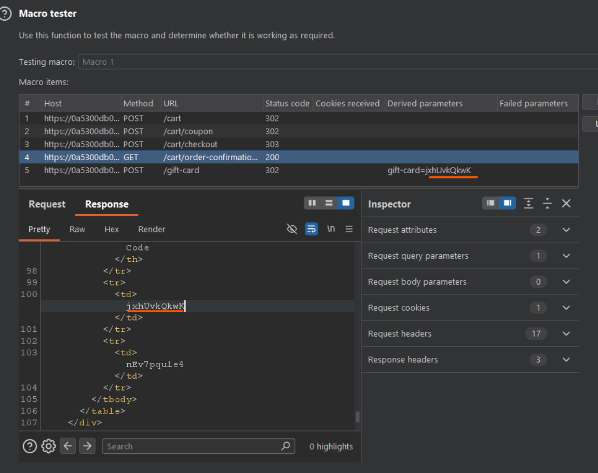

Gửi yêu cầu `GET /my-account` tới Burp Intruder. Đảm bảo rằng chế độ tấn công Sniper đã được chọn.
Tại bảng điều khiển bên cạnh mục Payloads, trong phần cấu hình Payload, hãy chọn loại payload là "Null payloads". Thiết lập để tạo ra __412__ payload.
Nhấp vào "Resource pool" để mở bảng điều khiển Resource pool. Thêm cuộc tấn công vào một resource pool với thiết lập "Maximum concurrent requests" (số lượng yêu cầu đồng thời tối đa) là 1. Bắt đầu cuộc tấn công.

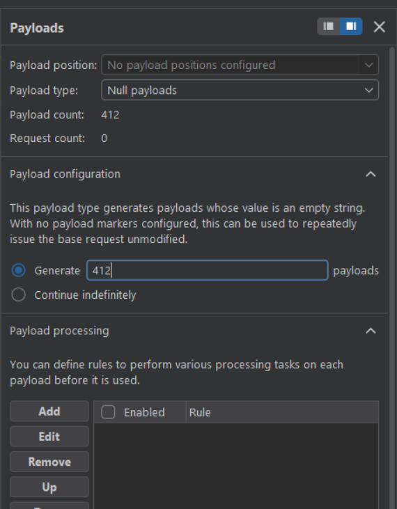

Sau đó ta đợi Intrder chạy.

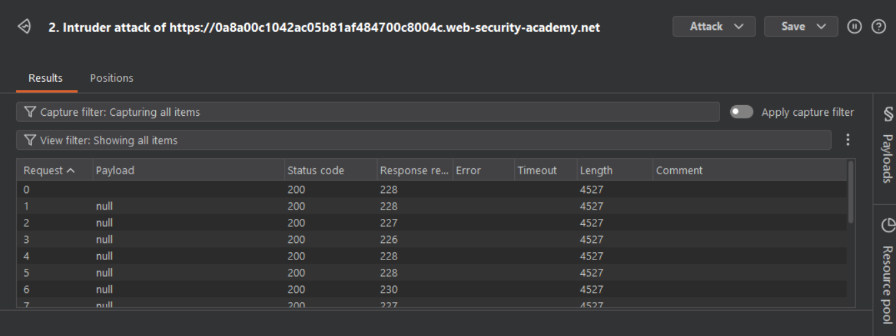

### Bước 3: Khai thác thành công

Sau khi Intrder chạy xong thì ta sẽ có dư 1 số tiền đủ để mua item Lightweight "l33t" Leather Jacket. 

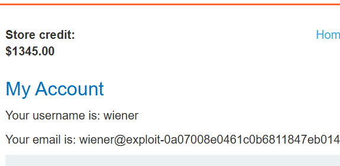

Đặt mua và bài lab sẽ được giải thành công!

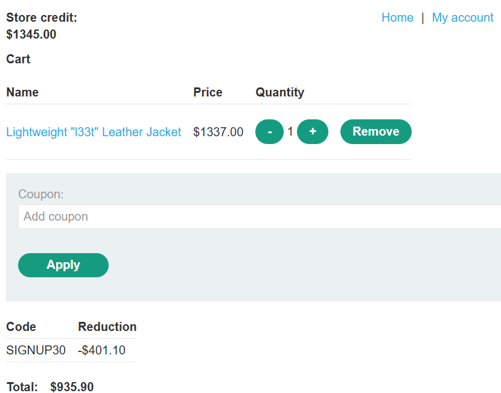

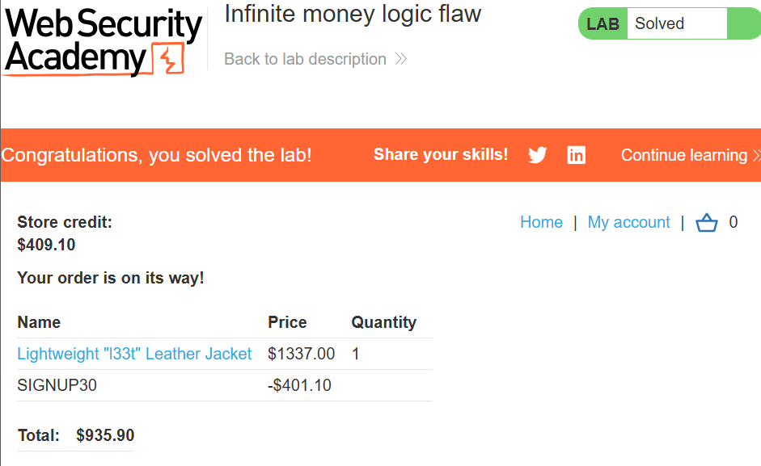

## 🛡️ Cách Fix / Mitigation

- Tính store credit dựa trên giá đã trả thực tế, không phải face value của gift card — lưu lại giá trị sau discount tại thời điểm mua, gắn liền với mã gift card đó.

- Giới hạn coupon chỉ áp dụng cho sản phẩm vật lý, không cho phép áp dụng lên các sản phẩm có thể chuyển đổi thành tiền/credit (gift card, voucher) — đây là nguyên tắc chung để tránh tạo vòng lặp tài chính.

- Rate limiting / giám sát hành vi bất thường — số lần mua + redeem gift card liên tục trong thời gian ngắn là dấu hiệu rõ ràng của automation, nên có cảnh báo hoặc giới hạn tốc độ giao dịch.

- One-time-use coupon thực sự — đảm bảo coupon chỉ áp dụng được 1 lần trên toàn hệ thống cho mỗi tài khoản, không chỉ check theo session/order hiện tại.

## 📝 Ghi chú / Lessons Learned

- Bug ở đây không phức tạp về mặt logic (tương tự lab "Flawed enforcement of business rules") — điểm khó thực sự là automation. Đây là bài học quan trọng: nhiều business logic flaw chỉ thực sự nguy hiểm khi có thể scale lên bằng tool.

- Burp Macro là kỹ năng mới học được — dùng để tự động hóa một chuỗi request phụ thuộc nhau (mỗi request cần lấy data động từ response trước đó), khác với Intruder thông thường chỉ lặp 1 request đơn lẻ.

- Pattern chung cần nhớ khi review bất kỳ flow "mua → đổi → nhận tiền": luôn hỏi "giá trị cộng vào có khớp với giá trị đã trừ ra không?" Nếu 2 con số này được tính ở 2 nơi khác nhau trong code (1 nơi tính giá sau discount, 1 nơi tính theo face value) → khả năng cao có lỗ hổng dạng này.

- Việc set Maximum concurrent requests = 1 trong Resource Pool quan trọng vì macro cần chạy tuần tự (sequential) — nếu chạy song song, gift card code có thể bị lấy sai thứ tự giữa các request.

---

**Tags:** `#business-logic` `#infinite-money` `#burp-macro` `#race-condition-adjacent` `#automation`